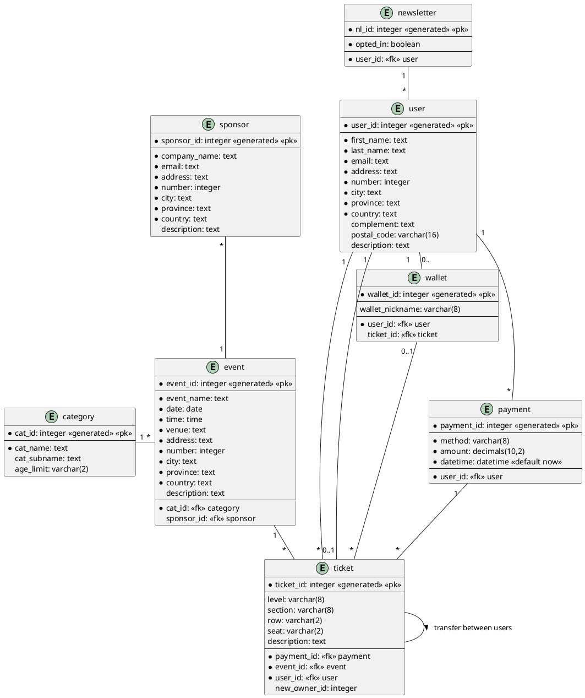

### Part A: ER modelling
# Logical Diagram

--um cliente pode ter many tickets

```plantuml
@startuml

entity newsletter{
* nl_id: integer <<generated>> <<pk>>
--
* opted_in: boolean
--
* user_id: <<fk>> user
}

entity user{
* user_id: integer <<generated>> <<pk>>
--
* first_name: text
* last_name: text
* email: text
* address: text
* number: integer
* city: text
* province: text
* country: text
complement: text
postal_code: varchar(16)
description: text
}

entity sponsor{
* sponsor_id: integer <<generated>> <<pk>>
--
* company_name: text
* email: text
* address: text
* number: integer
* city: text
* province: text
* country: text
description: text
}

entity category{
* cat_id: integer <<generated>> <<pk>>
--
* cat_name: text
cat_subname: text
age_limit: varchar(2)
}

entity event{
* event_id: integer <<generated>> <<pk>>
--
* event_name: text
* date: date
* time: time
* venue: text
* address: text
* number: integer
* city: text
* province: text
* country: text
description: text
--
* cat_id: <<fk>> category
sponsor_id: <<fk>> sponsor
}

entity payment{
* payment_id: integer <<generated>> <<pk>>
--
* method: varchar(8)
* amount: decimals(10,2)
* datetime: datetime <<default now>>
--
* user_id: <<fk>> user
}

entity ticket{
* ticket_id: integer <<generated>> <<pk>>
--
level: varchar(8)
section: varchar(8)
row: varchar(2)
seat: varchar(2)
description: text
--
* payment_id: <<fk>> payment
* event_id: <<fk>> event
* user_id: <<fk>> user
new_owner_id: integer
}

entity wallet{
* wallet_id: integer <<generated>> <<pk>>
--
wallet_nickname: varchar(8)
--
* user_id: <<fk>> user
ticket_id: <<fk>> ticket
}


   

user "1  " - " * " ticket

user "1" -- " * " payment

category "1" - "*" event

event "1" -- " *   " ticket

payment " 1   " -- " * " ticket

user "1     " - "0.." wallet

wallet "0..1 " - "  * " ticket

newsletter " 1 " -- "  * " user 

sponsor " * " -- "1 " event

ticket -- ticket: transfer between users >

ticket "0..1 " - "1" user


@enduml
```